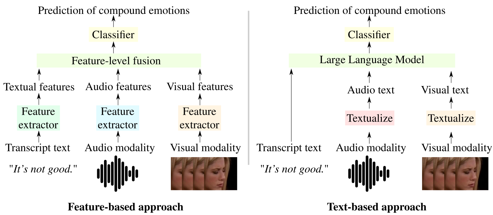

# [Textualized and Feature-based Models for Compound Multimodal Emotion Recognition in the Wild](https://arxiv.org/pdf/2407.12927)


by
**Nicolas Richet<sup>1</sup>,
Soufiane Belharbi<sup>1</sup>,
Haseeb Aslam<sup>1</sup>,
Meike Emilie Schadt<sup>3</sup>,
Manuela González-González<sup>2,3</sup>,
Gustave Cortal<sup>4,6</sup>,
Alessandro Lameiras Koerich<sup>1</sup>,
Marco Pedersoli<sup>1</sup>,
Alain Finkel<sup>4,5</sup>,
Simon Bacon<sup>2,3</sup>,
Eric Granger<sup>1</sup>**

<sup>1</sup> LIVIA, Dept. of Systems Engineering, ÉTS, Montreal, Canada
<br/>
<sup>2</sup> Dept. of Health, Kinesiology \& Applied Physiology, Concordia University, Montreal, Canada
<br/>
<sup>3</sup> Montreal Behavioural Medicine Centre, Montreal, Canada
<br/>
<sup>4</sup> Université Paris-Saclay, CNRS, ENS Paris-Saclay, LMF, 91190, Gif-sur-Yvette, France
<br/>
<sup>5</sup> Institut Universitaire de France, France
<br/>
<sup>6</sup> Université Paris-Saclay, CNRS, LISN, 91400, Orsay, France

<p align="center"></p>

[](https://arxiv.org/pdf/2407.12927)
[](https://github.com/nicolas-richet/feature-vs-text-compound-emotion)


## Abstract
Systems for multimodal emotion recognition (ER) are commonly trained to extract features from different modalities (e.g., visual, audio, and textual) that are combined to predict individual basic emotions. However, compound emotions often occur in real-world scenarios, and the uncertainty of recognizing such complex emotions over diverse modalities is challenging for feature-based models.
As an alternative, emerging multimodal large language models (LLMs) like BERT and LLaMA rely on explicit non-verbal cues that may be translated from different non-textual modalities (e.g., audio and visual) into text. Textualization of modalities augments data with emotional cues to help the LLM encode the interconnections between all modalities in a shared text space. In such text-based models, prior knowledge of ER tasks is leveraged to textualize relevant nonverbal cues such as audio tone from vocal expressions, and action unit intensity from facial expressions. Since the pre-trained weights are publicly available for many LLMs, training on large-scale datasets is unnecessary, allowing fine-tuning for downstream tasks such as compound ER (CER).
This paper compares the potential of text- and feature-based approaches for compound multimodal ER in videos. Experiments were conducted on the challenging C-EXPR-DB dataset in the wild for CER, and contrasted with results on the MELD dataset for basic ER. Our results indicate that multimodal textualization provides lower accuracy than feature-based models on C-EXPR-DB, where text transcripts are captured in the wild. However, higher accuracy can be achieved when the video data has rich transcripts.
Our code for the textualization approach is available at:
  [github.com/nicolas-richet/feature-vs-text-compound-emotion](https://github.com/nicolas-richet/feature-vs-text-compound-emotion). This repository contained the feature-based approach.

**This code is the feature-based approach presented in the paper.**

**Code: Pytorch 2.2.2**, made for the [7th-ABAW challenge](https://affective-behavior-analysis-in-the-wild.github.io/7th/).


## Citation:
```
@article{Richet-abaw-24,
  title={Textualized and Feature-based Models for Compound Multimodal Emotion Recognition in the Wild},
  author={Richet, N. and Belharbi, S. and Aslam, H. and Zeeshan, O. and Belharbi, S. and
  Koerich, A. L. and Pedersoli, M. and Bacon, S. and Granger, E.},
  journal={CoRR},
  volume={abs/2407.12927}
  year={2024}
}
```

## Installation of the environments
```bash
# Face cropping and alignment virtual env.
./create_v_env_face_extract.sh

# Pre-processing and training virtual env.
./create_v_env_main.sh
```

## Supported modalities:
- Vision: `vision`
- Audio: `vggish`
- Text: `bert`


## Pre-processing:
Read [./abaw5_pre_processing/README.txt](./abaw5_pre_processing/README.txt) and download the required file and unzip it.
1. **First**, split files should be created. See `abaw5_pre_processing/dlib/ds_name.py`. Copy one split: `train.txt, val.txt, test.txt` and `class_id.yaml`
from `./folds` into the root where the data resides `absolute_path_to_dataset/ds_name`.
In the next steps, each subset is processed separately: `train`, `val`, `test`.
In addition, a subset is divided into `n` blocks. Each block is processed
separately. For `MELD`, process `train, val, test` subsets. For `C-EXPR-DB`,
process only `train, valid` (test == valid). For `C-EXPR-DB-CHALLENGE`,
only `test` should be processed.
2. **Face cropping and alignment**: Here is an example of processing `MELD`,
`train` which is divided into 8 blocks, and we process block 0.

```bash
#!/usr/bin/env bash

source ~/venvs/abaw-7-face-extract/bin/activate

cudaid=$1
export CUDA_VISIBLE_DEVICES=$cudaid

python abaw5_pre_processing/dlib/c_expr_db.py --ds C-EXPR-DB --split train --nblocks 8 --process_block 0
```
3. **Feature extraction**:

```bash
#!/usr/bin/env bash

source ~/venvs/abaw-7/bin/activate

cudaid=$1
export CUDA_VISIBLE_DEVICES=$cudaid


python abaw5_pre_processing/project/abaw5/main.py --ds C-EXPR-DB --split train --nparts 10 --part 0

# ==============================================================================
```
Since feature extraction is done by block, we need to gather all the blocks for some results files `processing_records*`, and `dataset_info*`. These 2 files need to hold some information for all data. Run:

```bash
python post_feature_extract.py
```
Before running this, change the name of the dataset in `post_feature_extract.py`.
4. **Compact of face images**: Cropped faces need to be compacted into a single file, similarly to other modalities. Example:

```bash
#!/usr/bin/env bash

source ~/venvs/abaw-7-face-extract/bin/activate

cudaid=$1
export CUDA_VISIBLE_DEVICES=$cudaid


python abaw5_pre_processing/dlib/compact_face_images.py --ds C-EXPR-DB --split train --nparts 1 --part 0

```
Read these comments in the file `compact_face_images.py` first, and edit accordingly:

```python
# first pass: comment the next line.
# second pass. Comment this next line in the first pass.
# assert sz == n, f"{modal} | {sz} | {n} | {dest}"
```

## Training:
```bash
#!/usr/bin/env bash

source ~/venvs/abaw-7/bin/activate

# ==============================================================================
cudaid=$1
export CUDA_VISIBLE_DEVICES=$cudaid


python main.py \
       --dataset_name MELD \
       --use_other_class False \
       --train_p 100.0 \
       --valid_p 100.0 \
       --test_p 100.0 \
       --amp True \
       --seed 0 \
       --mode TRAINING \
       --resume False \
       --modality video+vggish+bert+EXPR_continuous_label \
       --calc_mean_std True \
       --emotion LATER \
       --model_name LFAN \
       --num_folds 1 \
       --fold_to_run 0 \
       --num_heads 2 \
       --modal_dim 32 \
       --tcn_kernel_size 5 \
       --num_epochs 1000 \
       --min_num_epochs 5 \
       --early_stopping 50 \
       --window_length 300 \
       --hop_length 200 \
       --train_batch_size 2 \
       --eval_batch_size 1 \
       --num_workers 6 \
       --opt__weight_decay 0.0001 \
       --opt__name_optimizer SGD \
       --opt__lr 0.0001 \
       --opt__momentum 0.9 \
       --opt__dampening 0.0 \
       --opt__nesterov True \
       --opt__beta1 0.9 \
       --opt__beta2 0.999 \
       --opt__eps_adam 1e-08 \
       --opt__amsgrad False \
       --opt__lr_scheduler True \
       --opt__name_lr_scheduler MYSTEP \
       --opt__gamma 0.9 \
       --opt__step_size 50 \
       --opt__last_epoch -1 \
       --opt__min_lr 1e-07 \
       --opt__t_max 100 \
       --opt__mode MIN \
       --opt__factor 0.5 \
       --opt__patience 10 \
       --opt__gradual_release 1 \
       --opt__release_count 3 \
       --opt__milestone 0 \
       --opt__load_best_at_each_epoch True \
       --exp_id 07_17_2024_09_48_48_088070__8018213
```

## Testing on challenge CER:

```bash
#!/usr/bin/env bash

source ~/venvs/abaw-7/bin/activate

# ==============================================================================
cudaid=$1
export CUDA_VISIBLE_DEVICES=$cudaid

python inference_challenge.py \
       --mode EVALUATION \
       --case_best_model FRAMES_AVG_LOGITS \
       --target_ds_name C-EXPR-DB-CHALLENGE \
       --eval_set test \
       --fd_exp ABOLSUTE_APTH_TO_FOLDER_EXP
```

## Thanks
This code is heavily based on [github.com/sucv/ABAW3](https://github.com/sucv/ABAW3).
